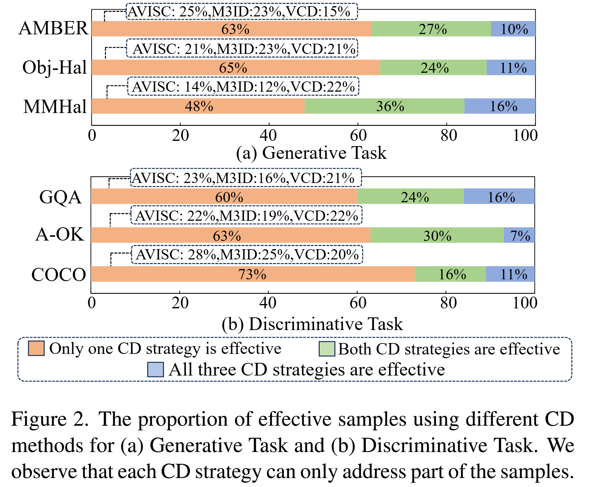
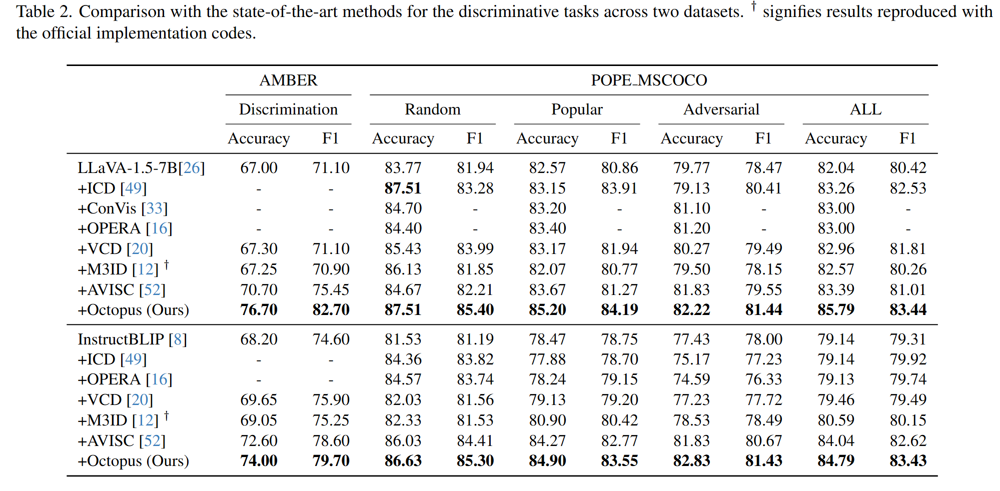

<p align="center" width="100%">

</p>

# Octopus: Alleviating Hallucination via Dynamic Contrastive Decoding
<!-- Arxiv Link, Project Link -->
<div style='display:flex; gap: 0.25rem; '>
<a href="https://arxiv.org/abs/2503.00361"></a>

<a href='LICENSE'></a>
</div>

This repository contains the official pytorch implementation of the CVPR2025 paper: "Octopus: Alleviating Hallucination via Dynamic Contrastive Decoding".


## Updates
We will update more detailed result (including dataset, training, verification) in the future

- [x] **2025.02.27**: Build project page
- [x] **2025.03.03**:Add code and .sh file
- [x] **2025.03.04**:Add Dataset
- [x] **2025.03.04**:Add detailed process description


<!-- ## Motivation
<p align="center" width="100%">

</p>

As shown in Fig. 2(b), we report the corresponding percentages and observe that each CD strategy addresses a subset of the samples, and only 10\% of cases are effective across all three methods. Based on the above results, we conclude that ***each CD method is only effective on specific hallucinated samples, and using a single strategy for all cases would inevitably lead to sub-optimal results.***

<p align="center" width="100%">

</p>

 As shown in Fig. 3, we use ''strategy-1'', ''strategy-2'' and ''strategy-3'' to denote the hallucination mitigation strategies(i.e., VCD, M3ID and AVISC). Meanwhile, we exhibit the best scores from these combinations. Take “strategy 1+3” as an example, each of the three tokens has two selectable hallucination elimination strategies (i.e., strategy-1 and strategy-3), thus there are a total of 6 combinations. For simplicity, we only report the best results among these combinations. By comparing these scores, we find that leveraging multiple CD strategies can better suppress hallucinations. Therefore, we conclude that ***the hallucination causes are hybrid and each generative step faces different forms of challenge.*** -->

## Method: Octopus
<p align="center" width="100%">

</p>

## Environment Setup

```bash
conda env create --file Octopus.yaml
```
or

```bash
conda create Octopus python=3.10
conda activate Octopus
git clone https://github.com/LijunZhang01/Octopus
cd Octopus
pip install -r requirements.txt
```
## Dataset
- Please download and extract the MSCOCO 2014 dataset from [this link](https://cocodataset.org/) to the ''dataset'' folder
- For AMBER evaluation, see [this link](https://github.com/junyangwang0410/AMBER),and then move to the ''data'' folder

The directory structure is as follows:
```
+ data
  -train.json
  -image(AMBER dataset image)
  -query
  -relation.json
  -safe_words.txt
  -annotations.json
  -metrics.txt
+ dataset
  -images(COCO dataset image)
```


## Models
*About model Pre-trained checkpoints*
* [**LLaVA-1.5**](https://github.com/haotian-liu/LLaVA): Download [LLaVA-1.5 merged 7B](https://huggingface.co/liuhaotian/llava-v1.5-7b)
* [**InstructBLIP**](https://github.com/salesforce/LAVIS/tree/main/projects/instructblip): Download [InstructBLIP](https://huggingface.co/Salesforce/instructblip-vicuna-7b)

## Train
* **AMBER**: 
```
bash eval_bench/scripts/train_token_amber.sh
```
- Need to specify "json_path", "data_path","checkpoint_path","model_path"

- ps: Replace all "/home/zlj/Octopus" paths with your own directory paths

## Evaluation
* **AMBER**: 
```
bash eval_bench/scripts/eval_token_amber.sh
```
- Need to specify "json_path", "data_path","checkpoint_path","model_path"

- ps: Replace all "/home/zlj/Octopus" paths with your own directory paths


## Results

### Generative Task
<p align="center" width="100%">

</p>

### Discriminative Task.
<p align="center" width="100%">

</p>


<!-- ## LLaVA-Bench Examples
<p align="center" width="100%">

</p> -->


## Acknowledgments
This codebase borrows from most notably [VCD](https://github.com/DAMO-NLP-SG/VCD), [AvisC](https://github.com/sangminwoo/AvisC), and [LLaVA](https://github.com/haotian-liu/LLaVA).
Many thanks to the authors for generously sharing their codes!


## Citation
If you find this repository helpful for your project, please consider citing our work :
```
@misc{suo2025octopusalleviatinghallucinationdynamic,
      title={Octopus: Alleviating Hallucination via Dynamic Contrastive Decoding}, 
      author={Wei Suo and Lijun Zhang and Mengyang Sun and Lin Yuanbo Wu and Peng Wang and Yanning Zhang},
      year={2025},
      eprint={2503.00361},
      archivePrefix={arXiv},
      primaryClass={cs.CV},
      url={https://arxiv.org/abs/2503.00361}, 
}
```
