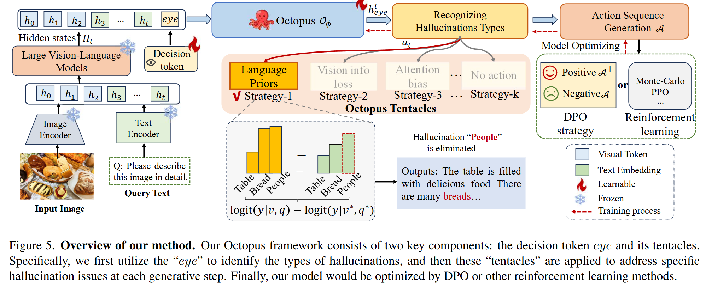

<p align="center" width="100%">

</p>

# Octopus: Alleviating Hallucination via Dynamic Contrastive Decoding


This repository contains the official pytorch implementation of the CVPR2025 paper: "Octopus: Alleviating Hallucination via Dynamic Contrastive Decoding".


## Updates
We will update more detailed result (including dataset, training, verification) in the future

 * **2025.02.27**: Build project page
- [ ] :Add code and .sh file
- [ ] :Add Dataset
- [ ] :Add detailed process description


## Motivation
<p align="center" width="100%">

</p>

As shown in Fig. 2(b), we report the corresponding percentages and observe that each CD strategy addresses a subset of the samples, and only 10\% of cases are effective across all three methods. Based on the above results, we conclude that ***each CD method is only effective on specific hallucinated samples, and using a single strategy for all cases would inevitably lead to sub-optimal results.***

<p align="center" width="100%">

</p>

 As shown in Fig. 3, we use ''strategy-1'', ''strategy-2'' and ''strategy-3'' to denote the hallucination mitigation strategies(i.e., VCD, M3ID and AVISC). Meanwhile, we exhibit the best scores from these combinations. Take “strategy 1+3” as an example, each of the three tokens has two selectable hallucination elimination strategies (i.e., strategy-1 and strategy-3), thus there are a total of 6 combinations. For simplicity, we only report the best results among these combinations. By comparing these scores, we find that leveraging multiple CD strategies can better suppress hallucinations. Therefore, we conclude that ***the hallucination causes are hybrid and each generative step faces different forms of challenge.***

## Method: AvisC
<p align="center" width="100%">

</p>


## Setup
```bash
conda create Octopus python=3.10
conda activate Octopus
git clone https://github.com/LijunZhang01/Octopus
cd Octopus
pip install -r requirements.txt
```


## Models
*About model Pre-trained checkpoints*
* [**LLaVA-1.5**](https://github.com/haotian-liu/LLaVA): Download [LLaVA-1.5 merged 7B](https://huggingface.co/liuhaotian/llava-v1.5-7b)
* [**InstructBLIP**](https://github.com/salesforce/LAVIS/tree/main/projects/instructblip): Download [InstructBLIP](https://huggingface.co/Salesforce/instructblip-vicuna-7b)

## Evaluation
* **POPE**: `bash eval_bench/scripts/pope_eval.sh` 
  - Need to specify "model", "model_path"
  - Need to specify "model", "model_path"
* **AMBER**: `bash experiments/cd_scripts/amber_eval.sh`
  - Need to specify "model", "model_path"

*About datasets preparation*
- Please download and extract the MSCOCO 2014 dataset from [this link](https://cocodataset.org/) to your data path for evaluation.
- For AMBER evaluation, see [this link](https://github.com/junyangwang0410/AMBER).


## Results

### Generative Task
<p align="center" width="100%">

</p>

### Discriminative Task.
<p align="center" width="100%">

</p>


## LLaVA-Bench Examples
<p align="center" width="100%">

</p>


## Acknowledgments
This codebase borrows from most notably [VCD](https://github.com/DAMO-NLP-SG/VCD), [AvisC](https://github.com/sangminwoo/AvisC), and [LLaVA](https://github.com/haotian-liu/LLaVA).
Many thanks to the authors for generously sharing their codes!


## Citation
If you find this repository helpful for your project, please consider citing our work :

